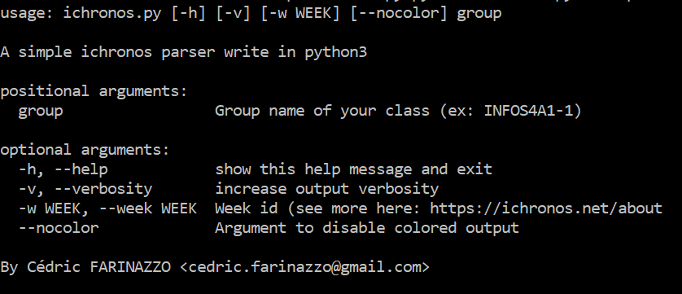
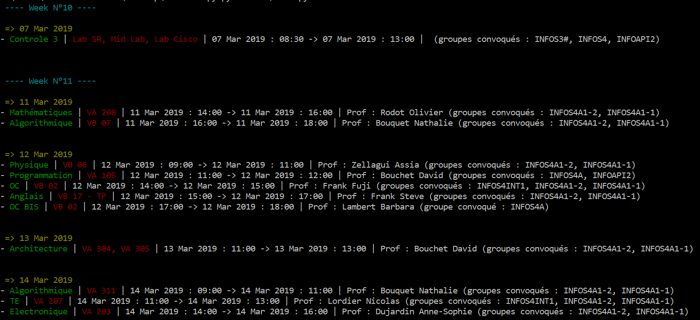

## ichronos.py

[](https://www.codacy.com/app/cedricfarinazzo/ichronos.py?utm_source=github.com&amp;utm_medium=referral&amp;utm_content=cedricfarinazzo/ichronos.py&amp;utm_campaign=Badge_Grade)

A simple [ichronos](https://ichronos.net/) parser write in python3

### Example


### How to install ?
- clone this repo
- install dependencies
```
pip install -r requirements.txt
```
### How to use ?

- On windows cmd
```
ichronos.bat <arg>
```

- on linux
```
./ichronos.sh <arg>
```

### Help page

